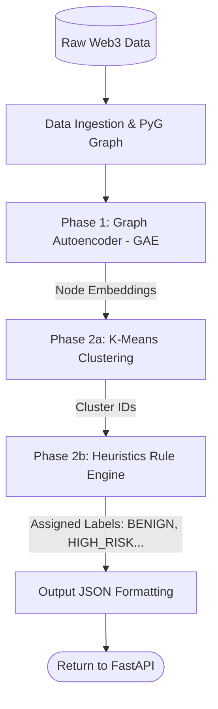

# Fix Scope Creep in Module 1 Workflow Documentation

Bạn là một System Architect và Technical Writer. Trước đó, bạn đã viết file `docs/module1_detailed_workflow.md` dựa trên mã nguồn Colab. Tuy nhiên, tài liệu hiện tại đang bị **vượt quá phạm vi (scope creep)** khi đưa cả phần Huấn luyện có giám sát (Supervised Classifier - Phase 3) vào.

Trong kiến trúc hệ thống của chúng ta:

- **Module 1 (Macro View):** CHỈ bao gồm Học không giám sát (GAE), Phân cụm (K-Means) và Gán nhãn bằng luật (Heuristics).
- **Module 2 (Micro View):** Mới là nơi chạy mô hình phân loại có giám sát (GAT/Transformer) ở thời gian thực.

## Nhiệm vụ (Task Section)

Sử dụng công cụ `editFiles` để chỉnh sửa trực tiếp file `docs/module1_detailed_workflow.md`. Hãy cắt bỏ toàn bộ các thông tin liên quan đến Supervised Learning và tinh chỉnh lại luồng văn bản/biểu đồ cho chuẩn xác.

## Hướng dẫn từng bước (Instructions)

### Bước 1: Sửa biểu đồ Flowchart (Mục 3.1)

Cập nhật khối Mermaid Flowchart. Loại bỏ hoàn toàn khối Phase 3. Hãy dùng đoạn code Mermaid chuẩn dưới đây:

### Bước 2: Xóa mục Phase 3 (Mục 3.3 cũ)

Xóa bỏ hoàn toàn phần viết về "Phase 3: Supervised Transfer Learning (Classifier)", "Transformer/GAT" hay "Focal Loss". Nội dung của mục 3 chỉ dừng lại ở "Phase 2: Clustering & Pseudo-labeling (K-Means + Heuristics)".

### Bước 3: Cập nhật phần Kết xuất đầu ra (Mục 4)

Xóa bỏ các đoạn nhắc đến "Từ supervised output -> JSON". Thay vào đó, giải thích rõ: "Ngay sau khi hệ luật Heuristics gán nhãn xong, đồ thị được đóng gói thành định dạng chuẩn `GraphDataSchema` (JSON) để trả về cho FastAPI". Nêu rõ cấu trúc JSON gồm mảng `nodes` (có cluster_id, risk_score, label) và `links`.

### Bước 4: Kiểm tra Sơ đồ Sequence (Mục 1.1)

Đảm bảo sơ đồ Sequence Diagram giữa `Frontend` -> `FastAPI` -> `Modal Worker` vẫn được giữ nguyên và chỉ mô tả đến bước "K-Means & Heuristics Labeling" bên trong Modal Worker.

## Định dạng Output (Output Format)

- Chỉnh sửa trực tiếp (Overwrite/Edit) file `docs/module1_detailed_workflow.md` trong workspace hiện tại.
- Đảm bảo tài liệu sau khi sửa giữ được văn phong học thuật, các thẻ Heading (H1, H2, H3) liền mạch và không bị đứt gãy do quá trình xóa nội dung.
