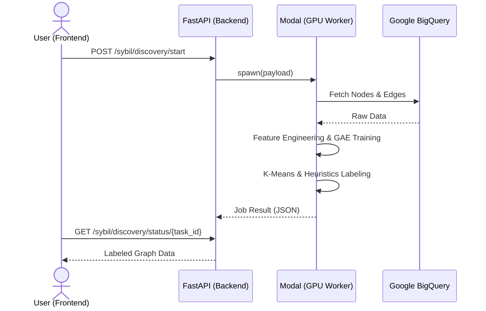
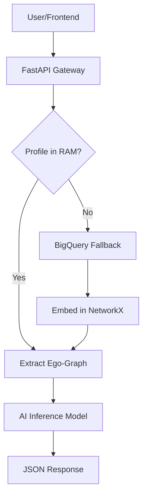

# 🌐 Lens Protocol Sybil Detection API

[Python](https://www.python.org/)
[FastAPI](https://fastapi.tiangolo.com/)
[Modal](https://modal.com/)
[PyTorch](https://pytorch.org/)

A robust backend and serverless GPU worker for discovering and annotating Sybil accounts in Web3 social graphs. This project implements a multi-module architecture: **Module 1** for cluster discovery and **Module 2** for real-time profile inspection.

---

## ✨ Key Features

- **Module 1: Sybil Discovery Engine**:
  - **Train-on-the-fly Pipeline**: Reconstructs social graphs and trains ML models dynamically based on query time ranges.
  - **Deep Graph Analysis**: Combines Semantic Text Embeddings (S-BERT) with On-chain behavioral features.
  - **Hybrid AI Architecture**: Uses **GAE + GAT** for unsupervised representation learning followed by **K-Means** and **Heuristic Pseudo-labeling**.
- **Module 2: Profile Inspector**:
  - **Real-time Microscope**: Deep-dive into specific profiles with ego-graph visualization and AI-powered risk scoring.
  - **Hybrid Cache Architecture**: Uses a high-performance **NetworkX Backbone** in RAM for sub-50ms queries.
  - **On-demand Fallback**: Automatically pulls and embeds missing nodes from BigQuery into the RAM graph.
- **Serverless GPU Execution**: Offloads heavy ML training and inference to [Modal](https://modal.com/) for scalable, on-demand compute.
- **Full Data Provenance**: Seamlessly integrates with Google BigQuery for Lens Protocol mainnet data.

---

## 🏗️ Architecture Overview

The system combines a FastAPI gateway with serverless GPU workers and maintains an in-memory "Reference Graph" for fast local inspection.

### 🛰️ Module 1: Discovery Workflow



### 🔬 Module 2: Inspector (Hybrid Cache)



---

## 🧠 Core ML Pipeline (Module 1)

1. **Data Ingestion**: Pulls account metadata and interactions (Follow, Comment, Quote) from BigQuery.
2. **Feature Engineering**: Concatenates 384D Text Embeddings (S-BERT) with normalized on-chain stats (Follower count, Post frequency, etc.).
3. **Unsupervised Representation**: A **Graph Autoencoder (GAE)** with a **GAT Encoder** learns structural node embeddings.
4. **Clustering**: **K-Means** identifies communities within the embedding space.
5. **Heuristic Scoring**: An additive risk engine evaluates clusters based on shared ownership, creation time proximity, and profile similarity.

---

## 🛠️ Tech Stack

- **Backend**: FastAPI, Pydantic v2, NetworkX.
- **ML Infrastructure**: Modal (Serverless GPU).
- **ML Libraries**:
  - `torch` & `torch-geometric` (GAT, GAE).
  - `sentence-transformers` (all-MiniLM-L6-v2).
  - `scikit-learn` (K-Means, MinMaxScaler).
- **Data Engineering**: `google-cloud-bigquery`, `pandas`.

---

## 🚀 Getting Started

### 1. Prerequisites

- Python 3.10+
- [Modal Account](https://modal.com/signup)
- Google Cloud Service Account with BigQuery access.

### 2. Local Setup

```bash
# Install dependencies
pip install -r requirements.txt

# Configure Credentials
# Place your service account JSON in .creds/service-account-key.json
mkdir .creds
cp path/to/your/key.json .creds/service-account-key.json
```

> [!IMPORTANT]
> The system prioritizes `.creds/service-account-key.json`. Alternatively, set the `GOOGLE_APPLICATION_CREDENTIALS` environment variable.

### 3. Deploy Modal Worker

```bash
modal deploy modal_worker/app.py
```

### 4. Run the API Gateway

```bash
uvicorn app.main:app --reload
```

---

## 📡 API Usage

### 🛰️ Discovery (Module 1)

```bash
# Start Discovery Job
curl -X POST "http://localhost:8000/api/v1/sybil/discovery/start" \
  -H "Content-Type: application/json" \
  -d '{"time_range": {"start_date": "2025-12-01", "end_date": "2025-12-07"}}'

# Poll Status
curl "http://localhost:8000/api/v1/sybil/discovery/status/<task_id>"
```

### 🔍 Inspector (Module 2)

```bash
curl "http://localhost:8000/api/v1/inspector/profile/0x1f0c7f46cefd4daceaaf69e080d30fee06578f5a"
```

---

> [!TIP]
> For a deep dive into the ML pipeline, see the [Detailed Workflow Documentation](docs/module1_detailed_workflow.md).
