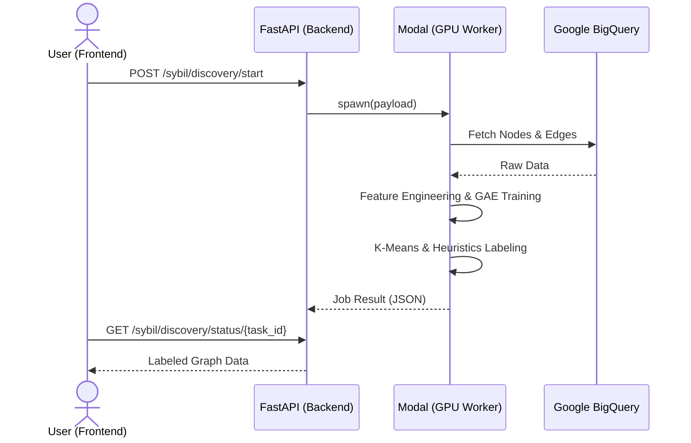

# 🌐 Lens Protocol Sybil Detection API

[](https://www.python.org/)
[](https://fastapi.tiangolo.com/)
[](https://modal.com/)
[](https://pytorch.org/)

A robust backend and serverless GPU worker for discovering and annotating Sybil accounts in Web3 social graphs. This project implements **Module 1: Sybil Discovery Engine**, utilizing Graph Autoencoders (GAE) and Graph Attention Networks (GAT) to identify anomalous clusters on the Lens Protocol.

---

## ✨ Key Features

- **Train-on-the-fly Pipeline**: Reconstructs social graphs and trains ML models dynamically based on query time ranges.
- **Serverless GPU Execution**: Offloads heavy ML workloads to [Modal](https://modal.com/) for scalable, on-demand GPU compute.
- **Deep Graph Analysis**: Combines Semantic Text Embeddings (S-BERT) with On-chain behavioral features.
- **Hybrid AI Architecture**: Uses **GAE + GAT** for unsupervised representation learning followed by **K-Means** and **Heuristic Pseudo-labeling**.
- **Full Data Provenance**: Seamlessly integrates with Google BigQuery to pull Lens Protocol mainnet data.

---

## 🏗️ Architecture Overview

The system consists of a FastAPI gateway that spawns serverless jobs on Modal. The worker pulls data, builds a PyTorch Geometric graph, trains the GAE model, and returns a labeled risk graph.



> [!TIP]
> For a deep dive into the ML pipeline and SQL queries, see the [Detailed Workflow Documentation](docs/module1_detailed_workflow.md).

---

## 🛠️ Tech Stack

- **Backend Gateway**: FastAPI, Pydantic v2, Uvicorn.
- **ML Infrastructure**: Modal (Serverless GPU).
- **ML Libraries**:
  - `torch` & `torch_geometric` (GAT, GAE).
  - `sentence-transformers` (all-MiniLM-L6-v2).
  - `scikit-learn` (K-Means, MinMaxScaler).
- **Data Engineering**: `google-cloud-bigquery`, `pandas`, `networkx`.

---

## 📁 Project Structure

```text
.
├── app/
│   ├── api/v1/             # API Router and Endpoints
│   ├── core/               # Configuration and Settings
│   ├── schemas/            # Pydantic Data Models
│   ├── services/           # Business Logic (Modal orchestration)
│   └── main.py             # FastAPI Application Entrypoint
├── docs/
│   ├── colab-code/         # Experimental Research Code
│   └── module1_workflow.md # Technical Deep Dives
├── modal_worker/
│   └── app.py              # Modal Worker Implementation
├── .env.example            # Environment Template
└── requirements.txt        # Local dependencies
```

---

## 🚀 Getting Started

### 1. Prerequisites

- Python 3.11+
- [Modal Account](https://modal.com/signup)
- Google Cloud Service Account with BigQuery access.

### 2. Local Setup

```bash
# Clone and install
git clone <repo-url>
cd sybil-detection-api
python -m venv .venv
source .venv/bin/activate
pip install -r requirements.txt

# Configure environment
cp .env.example .env
```

### 3. Deploy Modal Worker

> [!IMPORTANT]
> You must have `modal` CLI configured (`modal token set`).

```bash
modal deploy modal_worker/app.py
```

### 4. Run the API Gateway

```bash
uvicorn app.main:app --reload
```

---

## 📡 API Usage Examples

### Start Discovery Job

```bash
curl -X POST "http://localhost:8000/api/v1/sybil/discovery/start" \
  -H "Content-Type: application/json" \
  -d '{
    "time_range": {
      "start_date": "2025-12-01 00:00:00",
      "end_date": "2025-12-07 00:00:00"
    }
  }'
```

### Poll Status and Retrieve Graph

```bash
curl "http://localhost:8000/api/v1/sybil/discovery/status/<task_id>"
```

---

## 🧠 Core ML Pipeline

1.  **Data Ingestion**: Pulls account metadata and interactions (Follow, Comment, Quote) from BigQuery.
2.  **Feature Engineering**: Concatenates 384D Text Embeddings with normalized on-chain stats (Follower count, Post frequency, etc.).
3.  **Unsupervised Representation**: A **Graph Autoencoder** with a **GAT Encoder** learns structural node embeddings.
4.  **Clustering**: **K-Means** identifies communities within the embedding space.
5.  **Heuristic Scoring**: An additive risk engine evaluates clusters based on shared ownership, creation time proximity, and profile similarity.

> [!NOTE]
> The system defaults to **Mock Mode** if Modal is unavailable, providing deterministic data for frontend development.
