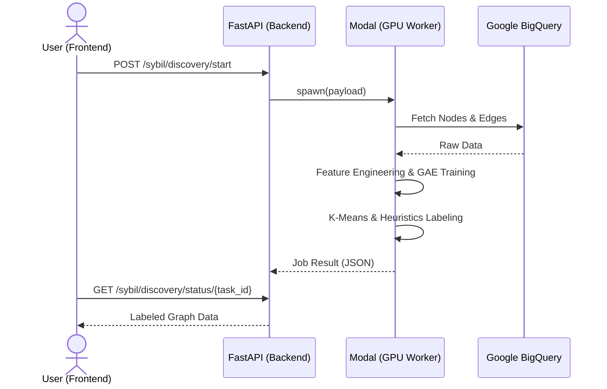

# 🌐 Lens Protocol Sybil Detection API

Python
FastAPI
Modal
PyTorch

A high-performance backend and serverless GPU worker suite for detecting Sybil account clusters in Web3 social graphs. This project features a dual-module architecture: **Module 1** for large-scale cluster discovery and **Module 2** for real-time, AI-powered profile inspection.

---

## ✨ Key Features

- **Module 1: Sybil Discovery Engine (Batch)**
  - **Train-on-the-fly**: Dynamically reconstructs social graphs and trains ML models based on specific time ranges.
  - **Deep Graph Analysis**: Combines Semantic Text Embeddings (S-BERT) with multi-layer interaction features.
  - **Hybrid AI Training**: Employs **Graph Autoencoders (GAE)** with **GAT** layers for representation learning, followed by K-Means and heuristic pseudo-labeling.
- **Module 2: Profile Inspector (Real-time)**
  - **Hybrid AI Inference**: Uses a 5-component pipeline (S-BERT + GAT + RF) to score profiles in sub-seconds.
  - **Sync-to-Train Pipeline**: 100% feature consistency with training, including 12-stat numeric normalization and mandatory NLP syntax.
  - **Graph Backbone**: High-performance **NetworkX** cache in RAM for instantaneous ego-graph extraction.
  - **On-demand Fallback**: Automatically fetches and embeds missing nodes from Google BigQuery into the live Backbone.
- **Scalable Infrastructure**
  - **Serverless GPU**: Offloads heavy training and inference tasks to [Modal](https://modal.com/).
  - **Data Provenance**: Integrated with Google BigQuery for direct access to Lens Protocol mainnet data.

---

## 🏗️ Architecture Overview

The system bridges a FastAPI gateway with serverless GPU workers, maintaining a "Graph Backbone" in RAM for low-latency inspection.

### 🛰️ Module 1: Discovery Workflow



### 🔬 Module 2: Real-time Inference Flow


---

## 🧠 Hybrid AI Pipeline (Inference)

To ensure maximum accuracy, the inference engine follows a strict stage process identical to the training environment:

1. **Numeric Preprocessing**: Extracts 12 specific on-chain metrics (trust score, activity levels, etc.) and scales them using a pre-trained `MinMaxScaler`.
2. **Semantic NLP**: Generates 384D embeddings from profile metadata (Handle, Name, Bio) using `all-MiniLM-L6-v2`.
3. **Graph Attention (GAT)**: A pre-trained GAT model processes the local ego-graph to extract a 16D structural embedding.
4. **Ensemble Classification**: A **Random Forest** model performs the final classification into four risk levels: `BENIGN`, `LOW_RISK`, `MEDIUM_RISK`, and `HIGH_RISK`.
5. **Reasoning Engine**: Scans direct graph connections (e.g., `CO-OWNER`, `SIM_BIO`) to generate human-readable explanations.

---

## 🛠️ Tech Stack

- **Backend**: FastAPI, Pydantic v2, NetworkX.
- **Data & ML**:
  - `torch` & `torch-geometric` (GAT, GAE).
  - `sentence-transformers` (NLP Embeddings).
  - `scikit-learn` & `joblib` (Random Forest & Scalers).
  - `pandas` & `numpy` (Data processing).
- **Infrastructure**: Modal (Serverless GPU), Google BigQuery.

---

## 🚀 Getting Started

### 1. Prerequisites

- Python 3.10+
- [Modal Account](https://modal.com/signup)
- Google Cloud Service Account with BigQuery access.

### 2. Local Setup

```bash
# Install dependencies
pip install -r requirements.txt

# Configure Credentials
# Place your service account JSON in .creds/service-account-key.json
mkdir .creds
cp path/to/your/key.json .creds/service-account-key.json
```

> [!IMPORTANT]
> The system prioritizes `.creds/service-account-key.json`. Alternatively, set the `GOOGLE_APPLICATION_CREDENTIALS` environment variable.

### 3. Deploy Modal Worker

```bash
modal deploy modal_worker/modal_app.py
```

### 4. Run the API Gateway

```bash
uvicorn app.main:app --reload
```

---

## 📡 API Documentation

### 🛰️ Module 1: Cluster Discovery (Batch)

#### 1. Start Discovery Job

`POST /api/v1/sybil/discovery/start`

Initiates an asynchronous GAE pipeline on Modal GPU.

**Request Body:**

```json
{
  "time_range": {
    "start_date": "2025-12-01",
    "end_date": "2025-12-07"
  },
  "max_nodes": 2000
}
```

**Success Response (200 OK):**

```json
{
  "task_id": "fc-1234ABCD"
}
```

#### 2. Poll Discovery Status

`GET /api/v1/sybil/discovery/status/{task_id}`

Retrieves job status and labeled graph data upon completion.

**Success Response (200 OK):**

```json
{
  "task_id": "fc-1234ABCD",
  "status": "COMPLETED",
  "progress": 100,
  "current_step": "FINALIZE_GRAPH",
  "graph_data": {
    "nodes": [
      {
        "id": "node-1",
        "label": "HIGH_RISK",
        "cluster_id": 0,
        "risk_score": 0.92,
        "attributes": { "address": "0x..." }
      }
    ],
    "links": [
      {
        "source": "node-1",
        "target": "node-2",
        "edge_type": "interaction",
        "weight": 0.7
      }
    ]
  },
  "message": null
}
```

---

### 🔍 Module 2: Profile Inspector (Real-time)

#### 1. Analyze Profile

`GET /api/v1/inspector/profile/{profile_id}`

Performs ego-graph extraction and Hybrid AI inference (S-BERT + GAT + RF).

**Success Response (200 OK):**

```json
{
  "profile_info": {
    "id": "0x123...",
    "handle": "vitalik.lens",
    "picture_url": "https://...",
    "owned_by": "0x..."
  },
  "analysis": {
    "sybil_probability": 0.05,
    "classification": "BENIGN",
    "reasoning": [
      "No significant Sybil patterns detected. Account behavior appears consistent with organic users."
    ]
  },
  "local_graph": {
    "nodes": [
      {
        "id": "0x123...",
        "attributes": {
          "handle": "vitalik.lens",
          "trust_score": 95.5
        }
      }
    ],
    "links": [
      {
        "source": "0x123...",
        "target": "0x456...",
        "edge_type": "FOLLOW",
        "weight": 2.0
      }
    ]
  }
}
```

---

> [!TIP]
> For a deep dive into the ML architecture and pseudo-labeling logic, see the [Detailed Workflow Documentation](docs/module1_detailed_workflow.md).
