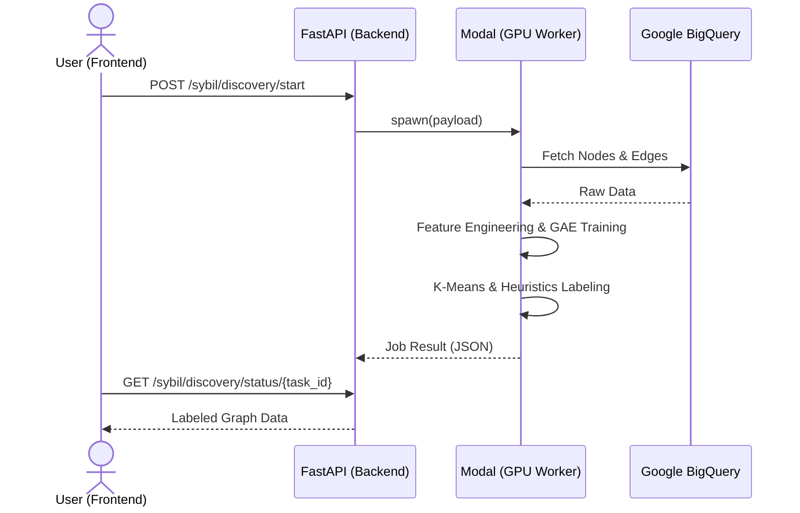

# 🌐 Lens Protocol Sybil Detection API

[](https://fastapi.tiangolo.com/)
[](https://modal.com/)
[](https://pytorch.org/)
[](https://www.python.org/)

A high-performance backend and serverless GPU worker suite for detecting Sybil account clusters in Web3 social graphs. This project features a dual-module architecture: **Module 1** for large-scale cluster discovery and **Module 2** for real-time, AI-powered profile inspection.

---

## ✨ Key Features

- **Module 1: Sybil Discovery Engine (Batch)**
  - **Train-on-the-fly**: Dynamically reconstructs social graphs and trains ML models based on specific time ranges.
  - **Deep Graph Analysis**: Combines Semantic Text Embeddings (S-BERT) with multi-layer interaction features.
  - **Hybrid AI Training**: Employs **Graph Autoencoders (GAE)** with **GAT** layers for representation learning, followed by K-Means and heuristic pseudo-labeling.
- **Module 2: Profile Inspector (Real-time)**
  - **Hybrid AI Inference**: Uses a 5-component pipeline (S-BERT + GAT + RF) to score profiles in sub-seconds.
  - **Sync-to-Train Pipeline**: 100% feature consistency with training, including 12-stat numeric normalization.
  - **Graph Backbone**: High-performance **NetworkX** cache in RAM for instantaneous ego-graph extraction.
  - **On-demand Fallback**: Automatically fetches and embeds missing nodes from Google BigQuery into the live Backbone.

---

## 🏗️ Architecture Overview

The system bridges a FastAPI gateway with serverless GPU workers, maintaining a "Graph Backbone" in RAM for low-latency inspection.

### 🛰️ Module 1: Discovery Workflow



### 🔬 Module 2: Real-time Inference Flow


---

## 📡 API Documentation

### 🛰️ Module 1: Cluster Discovery (Batch)

#### 1. Start Discovery Job
`POST /api/v1/sybil/discovery/start`

Initiates an asynchronous GAE pipeline on Modal GPU.

**Request Attributes:**

| Attribute | Type | Required | Default | Description |
| :--- | :--- | :---: | :--- | :--- |
| `time_range` | `object` | Yes | - | Time window for graph reconstruction. |
| `time_range.start_date` | `string` | Yes | - | Start date in `YYYY-MM-DD` format. |
| `time_range.end_date` | `string` | Yes | - | End date in `YYYY-MM-DD` format. |
| `max_nodes` | `integer` | No | `2000` | Maximum nodes to fetch from BigQuery. |
| `hyperparameters` | `object` | No | `null` | Training parameters for the GAE model. |
| `hyperparameters.max_epochs` | `integer` | No | `400` | Maximum training epochs. |
| `hyperparameters.patience` | `integer` | No | `30` | Early stopping patience. |
| `hyperparameters.learning_rate`| `float` | No | `0.005`| Model learning rate. |

**Success Response Attributes (200 OK):**

| Attribute | Type | Description |
| :--- | :--- | :--- |
| `task_id` | `string` | Unique identifier for the discovery job. |
| `status` | `enum` | `PROCESSING`, `COMPLETED`, or `FAILED`. |
| `progress` | `integer` | Completion percentage (0-100). |
| `current_step` | `string` | Human-readable description of current task. |
| `message` | `string` | Optional status or error message. |

#### 2. Poll Discovery Status
`GET /api/v1/sybil/discovery/status/{task_id}`

Retrieves job status and labeled graph data upon completion.

**Response Attributes (200 OK):**

| Attribute | Type | Description |
| :--- | :--- | :--- |
| `task_id` | `string` | Unique identifier for the discovery job. |
| `status` | `enum` | `PROCESSING`, `COMPLETED`, or `FAILED`. |
| `graph_data` | `object` | Labeled graph data (if `status` == `COMPLETED`). |
| `graph_data.nodes` | `array` | List of `Node` objects. |
| `graph_data.links` | `array` | List of `Link` objects. |
| `graph_data.cluster_count` | `integer` | Total number of clusters identified. |

**Node Object:**

| Attribute | Type | Description |
| :--- | :--- | :--- |
| `id` | `string` | Lens Profile ID. |
| `label` | `string` | Risk classification (e.g., `2_HIGH_RISK`, `0_BENIGN`). |
| `cluster_id` | `integer` | ID of the cluster the node belongs to. |
| `risk_score` | `float` | Calculated risk probability (0.0 - 1.0). |
| `attributes` | `object` | Metadata (handle, trust_score, owned_by, reason). |

**Link Object:**

| Attribute | Type | Description |
| :--- | :--- | :--- |
| `source` | `string` | Source node ID. |
| `target` | `string` | Target node ID. |
| `edge_type` | `string` | Interaction type (e.g., `FOLLOW`, `COLLECT`). |
| `weight` | `float` | Edge weight strength. |

---

### 🔍 Module 2: Profile Inspector (Real-time)

#### 1. Analyze Profile
`GET /api/v1/inspector/profile/{profile_id}`

Performs ego-graph extraction and Hybrid AI inference (S-BERT + GAT + RF).

**Response Attributes (200 OK):**

| Attribute | Type | Description |
| :--- | :--- | :--- |
| `profile_info` | `object` | Basic profile metadata. |
| `profile_info.id` | `string` | Lens Profile ID. |
| `profile_info.handle` | `string` | Lens handle. |
| `profile_info.picture_url`| `string` | URL to profile picture. |
| `profile_info.owned_by` | `string` | Owner wallet address. |
| `analysis` | `object` | AI inference results. |
| `analysis.sybil_probability`| `float` | Risk score (0.0 to 1.0). |
| `analysis.classification` | `string` | Final risk level classification. |
| `analysis.reasoning` | `array` | Human-readable explanation strings. |
| `local_graph` | `object` | Ego-graph (radius=1) direct connections. |
| `local_graph.nodes` | `array` | List of connected profiles with attributes. |
| `local_graph.links` | `array` | List of interaction edges. |

---

## 🧠 Hybrid AI Pipeline (Inference)

To ensure maximum accuracy, the inference engine follows a strict stage process identical to the training environment:

1. **Numeric Preprocessing**: Extracts 12 specific on-chain metrics (trust score, activity levels, etc.) and scales them using a pre-trained `MinMaxScaler`.
2. **Semantic NLP**: Generates 384D embeddings from profile metadata (Handle, Name, Bio) using `all-MiniLM-L6-v2`.
3. **Graph Attention (GAT)**: A pre-trained GAT model processes the local ego-graph to extract a 16D structural embedding.
4. **Ensemble Classification**: A **Random Forest** model performs the final classification into four risk levels: `BENIGN`, `LOW_RISK`, `MEDIUM_RISK`, and `HIGH_RISK`.
5. **Reasoning Engine**: Scans direct graph connections (e.g., `CO-OWNER`, `SIM_BIO`) to generate human-readable explanations.

---

## 🚀 Getting Started

### 1. Prerequisites

- Python 3.10+
- [Modal Account](https://modal.com/signup)
- Google Cloud Service Account with BigQuery access.

### 2. Local Setup

```bash
# Install dependencies
pip install -r requirements.txt

# Configure Credentials
# Place your service account JSON in .creds/service-account-key.json
mkdir .creds
cp path/to/your/key.json .creds/service-account-key.json
```

> [!IMPORTANT]
> The system prioritizes `.creds/service-account-key.json`. Alternatively, set the `GOOGLE_APPLICATION_CREDENTIALS` environment variable.

### 3. Deploy Modal Worker

```bash
modal deploy modal_worker/modal_app.py
```

### 4. Run the API Gateway

```bash
uvicorn app.main:app --reload
```

---

> [!TIP]
> For a deep dive into the ML architecture and pseudo-labeling logic, see the [Detailed Workflow Documentation](docs/module1_detailed_workflow.md).
