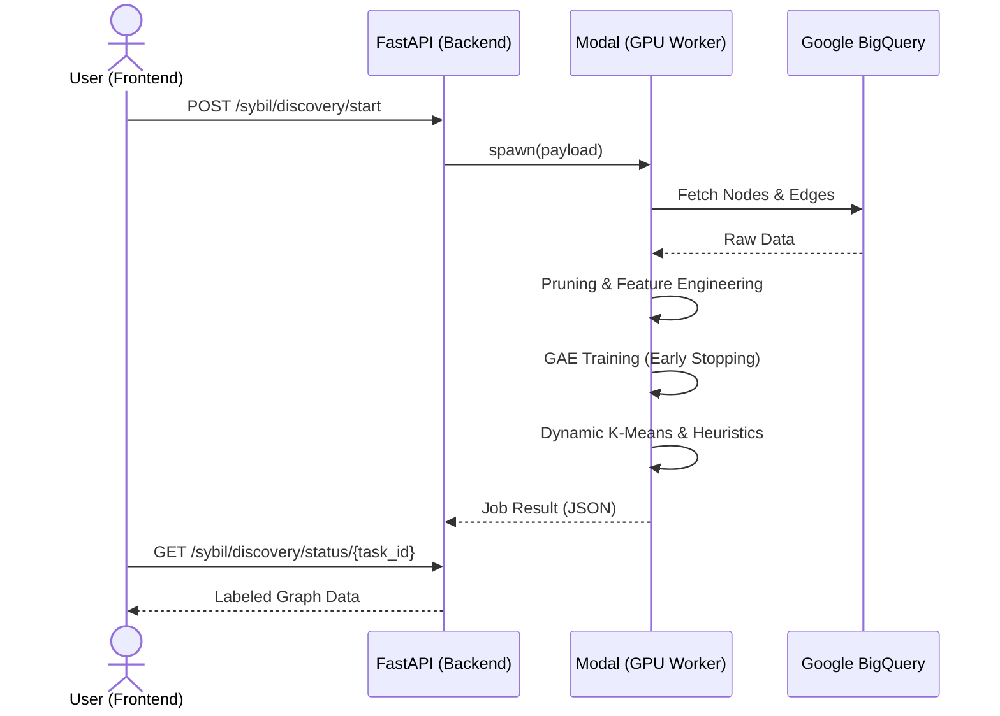
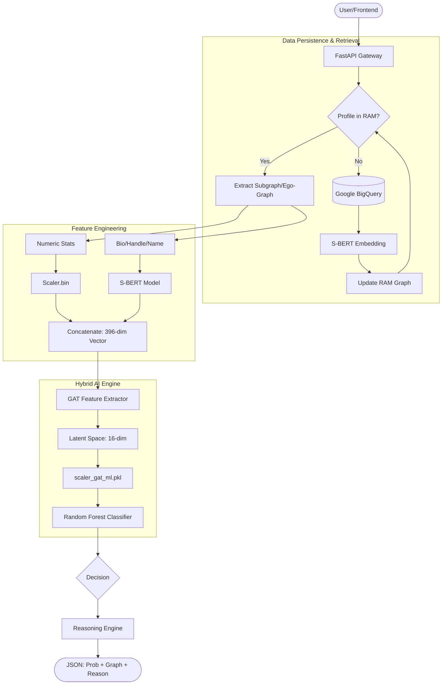

# 🌐 Lens Protocol Sybil Detection API

[](https://fastapi.tiangolo.com/)
[](https://modal.com/)
[](https://pytorch.org/)
[](https://www.python.org/)

A high-performance backend and serverless GPU worker suite for detecting Sybil account clusters in Web3 social graphs. This project features a dual-module architecture: **Module 1** for large-scale cluster discovery and **Module 2** for real-time, AI-powered profile inspection.

---

## ✨ Key Features

- **Module 1: Sybil Discovery Engine (Batch)**
  - **Train-on-the-fly**: Dynamically reconstructs social graphs and trains ML models based on specific time ranges.
  - **Dynamic Clustering**: Automatically calculates the optimal number of clusters (K) using a benchmarked square-root formula.
  - **Pruned Graph Discovery**: Focuses analysis on connected components by automatically pruning isolated nodes.
  - **Hybrid AI Training**: Employs **Graph Autoencoders (GAE)** with **GAT** layers and smart early stopping for representation learning.
- **Module 2: Profile Inspector (Real-time)**
  - **Hybrid AI Inference**: Uses a 5-component pipeline (S-BERT + GAT + RF) to score profiles in sub-seconds.
  - **Graph Enrichment**: Automatically discovers new relationships on-the-fly using a "2/3 Similarity" constraint (Avatar, Handle, Creation Time).
  - **Optimized NLP Similarity**: Performs real-time vector similarity searches (S-BERT) against the live RAM graph using matrix acceleration.
  - **Explainable AI (XAI)**: Extracts multi-layer **GAT Attention Weights** to visualize influential social connections.
  - **On-demand Fallback**: Automatically fetches and embeds missing nodes from Google BigQuery into the live Backbone.

---

## 🏗️ Architecture Overview

The system bridges a FastAPI gateway with serverless GPU workers, maintaining a high-performance "Graph Backbone" in RAM for low-latency inspection.

### 🛰️ Module 1: Discovery Workflow



### 🔬 Module 2: Real-time Inference Flow



---

## 📡 API Documentation

### 🛰️ Module 1: Cluster Discovery (Batch)

#### 1. Start Discovery Job

`POST /api/v1/sybil/discovery/start`

Initiates an asynchronous GAE pipeline on Modal GPU.

**Request Attributes:**

| Attribute                       | Type      | Required | Default | Description                            |
| :------------------------------ | :-------- | :------: | :------ | :------------------------------------- |
| `time_range`                    | `object`  |   Yes    | -       | Time window for graph reconstruction.  |
| `time_range.start_date`         | `string`  |   Yes    | -       | Start date in `YYYY-MM-DD` format.     |
| `time_range.end_date`           | `string`  |   Yes    | -       | End date in `YYYY-MM-DD` format.       |
| `max_nodes`                     | `integer` |    No    | `2000`  | Maximum nodes to fetch from BigQuery.  |
| `hyperparameters`               | `object`  |    No    | `null`  | Training parameters for the GAE model. |
| `hyperparameters.max_epochs`    | `integer` |    No    | `400`   | Maximum training epochs.               |
| `hyperparameters.patience`      | `integer` |    No    | `30`    | Early stopping patience.               |
| `hyperparameters.learning_rate` | `float`   |    No    | `0.005` | Model learning rate.                   |

**Success Response Attributes (200 OK):**

| Attribute      | Type      | Description                                 |
| :------------- | :-------- | :------------------------------------------ |
| `task_id`      | `string`  | Unique identifier for the discovery job.    |
| `status`       | `enum`    | `PROCESSING`, `COMPLETED`, or `FAILED`.     |
| `progress`     | `integer` | Completion percentage (0-100).              |
| `current_step` | `string`  | Human-readable description of current task. |
| `message`      | `string`  | Optional status or error message.           |

#### 2. Poll Discovery Status

`GET /api/v1/sybil/discovery/status/{task_id}`

Retrieves job status and labeled graph data upon completion.

**Response Attributes (200 OK):**

| Attribute                  | Type      | Description                                      |
| :------------------------- | :-------- | :----------------------------------------------- |
| `task_id`                  | `string`  | Unique identifier for the discovery job.         |
| `status`                   | `enum`    | `PROCESSING`, `COMPLETED`, or `FAILED`.          |
| `graph_data`               | `object`  | Labeled graph data (if `status` == `COMPLETED`). |
| `graph_data.nodes`         | `array`   | List of `Node` objects.                          |
| `graph_data.links`         | `array`   | List of `Link` objects.                          |
| `graph_data.cluster_count` | `integer` | Total number of clusters identified.             |

**Node Object (Golden Schema):**

| Attribute    | Type      | Description                                                                   |
| :----------- | :-------- | :---------------------------------------------------------------------------- |
| `id`         | `string`  | Lens Profile ID.                                                              |
| `risk_label` | `string`  | Sanitized classification (e.g., `HIGH_RISK`, `BENIGN`).                       |
| `cluster_id` | `integer` | ID of the cluster the node belongs to.                                        |
| `risk_score` | `float`   | Calculated risk probability (0.0 - 1.0).                                      |
| `attributes` | `object`  | Metadata (handle, trust_score, follower_count, post_count, owned_by, reason). |

**Link Object:**

| Attribute       | Type     | Description                                               |
| :-------------- | :------- | :-------------------------------------------------------- |
| `source`        | `string` | Source node ID.                                           |
| `target`        | `string` | Target node ID.                                           |
| `edge_type`     | `string` | Interaction type (e.g., `FOLLOW`, `COLLECT`).             |
| `weight`        | `float`  | Edge weight strength.                                     |
| `gat_attention` | `float`  | AI model's attention weight for this edge (0.0 to 1.0). |

---

### 🔍 Module 2: Profile Inspector (Real-time)

#### 1. Analyze Profile

`GET /api/v1/inspector/profile/{profile_id}`

Performs ego-graph extraction and Hybrid AI inference (S-BERT + GAT + RF).

**Response Attributes (200 OK):**

| Attribute                    | Type     | Description                                           |
| :--------------------------- | :------- | :---------------------------------------------------- |
| `profile_info`               | `object` | Basic profile metadata.                               |
| `profile_info.id`            | `string` | Lens Profile ID.                                      |
| `profile_info.handle`        | `string` | Lens handle.                                          |
| `profile_info.picture_url`   | `string` | URL to profile picture.                               |
| `profile_info.owned_by`      | `string` | Owner wallet address.                                 |
| `analysis`                   | `object` | AI inference results.                                 |
| `analysis.predict_label`     | `string` | The predicted risk level (e.g., `HIGH_RISK`).         |
| `analysis.predict_proba`     | `object` | Dictionary of probabilities for all risk levels.      |
| `analysis.reasoning`         | `array`  | Human-readable explanation strings.                   |
| `analysis.neighbor_labels`   | `object` | Dictionary mapping connected node IDs to risk labels. |
| `local_graph`                | `object` | Ego-graph (radius=1) with unified node schema.        |
| `local_graph.nodes`          | `array`  | List of connected profiles (Matching Node Object).    |
| `local_graph.links`          | `array`  | List of interaction edges (Matching Link Object).     |

---

### 📊 Module 3: Statistics & Insights

Provides real-time analytics and distribution data from the live RAM Backbone.

#### 1. Graph Overview

`GET /api/v1/stats/overview`

Returns total node/edge counts and distribution across interaction layers.

**Response Attributes (200 OK):**

| Attribute           | Type    | Description                                             |
| :------------------ | :------ | :------------------------------------------------------ |
| `total_nodes`       | `int`   | Total number of profiles in the RAM Backbone.           |
| `total_edges`       | `int`   | Total number of interactions (edges) in the Backbone.   |
| `edge_distribution` | `array` | List of layer distributions (Follow, Interact, etc.).   |

**Edge Distribution Item:**

| Attribute    | Type    | Description                                  |
| :----------- | :------ | :------------------------------------------- |
| `layer`      | `string`| The interaction layer name.                  |
| `count`      | `int`   | Number of edges in this layer.               |
| `percentage` | `float` | Percentage of total edges (0.0 - 100.0).     |

#### 2. Risk Distribution

`GET /api/v1/stats/risk-distribution`

Breakdown of the current RAM Backbone by assigned risk labels.

**Response Attributes (200 OK):**

| Attribute      | Type    | Description                                     |
| :------------- | :------ | :---------------------------------------------- |
| `distribution` | `array` | List of distribution items per risk label.      |

**Risk Distribution Item:**

| Attribute    | Type    | Description                                  |
| :----------- | :------ | :------------------------------------------- |
| `label`      | `string`| Risk classification (e.g., `HIGH_RISK`).      |
| `count`      | `int`   | Number of profiles with this label.          |
| `percentage` | `float` | Percentage of total profiles (0.0 - 100.0).  |

#### 3. Trust Score Analysis

`GET /api/v1/stats/trust-scores`

Calculates statistical frequency distribution (0-100) of profile trust scores.

**Response Attributes (200 OK):**

| Attribute | Type    | Description                                      |
| :-------- | :------ | :----------------------------------------------- |
| `bins`    | `array` | List of 10 frequency bins (e.g., "0-10", "10-20").|
| `mean`    | `float` | Arithmetic mean of all trust scores.             |
| `median`  | `float` | Median value of all trust scores.                |

#### 4. Cluster Statistics

`GET /api/v1/stats/clusters`

Analyzes identified clusters and their dimensions.

**Response Attributes (200 OK):**

| Attribute          | Type    | Description                                |
| :----------------- | :------ | :----------------------------------------- |
| `total_clusters`   | `int`   | Total number of identified clusters.        |
| `avg_cluster_size` | `float` | Average number of nodes per cluster.       |
| `largest_cluster`  | `int`   | Number of nodes in the largest cluster.    |
| `smallest_cluster` | `int`   | Number of nodes in the smallest cluster.   |

---

## 🧠 Hybrid AI Pipeline (Inference)

To ensure maximum accuracy, the inference engine follows a strict stage process 100% synchronized with the training environment:

1. **Numeric Preprocessing**: Extracts 12 specific on-chain metrics (Trust Score, Post Frequency, etc.) and scales them using a pre-trained `MinMaxScaler`.
2. **Semantic NLP**: Generates 384D embeddings from profile metadata (Handle, Name, Bio) using `all-MiniLM-L6-v2`.
3. **Graph Attention (GAT)**: A pre-trained GAT model processes the local ego-graph to extract a 16D structural embedding. **During this stage, multi-layer attention weights are extracted for XAI visualization.**
4. **Ensemble Classification**: A **Random Forest** model performs the final classification into four risk levels: `BENIGN`, `LOW_RISK`, `HIGH_RISK`, and `MALICIOUS`.
5. **Reasoning Engine**: Scans direct graph connections (e.g., `CO-OWNER`, `SIMILARITY`) to generate human-readable explanations.

---

## 🚀 Getting Started

### 1. Prerequisites

- Python 3.10+
- [Modal Account](https://modal.com/signup)
- Google Cloud Service Account with BigQuery access.

### 2. Local Setup

```bash
# Install dependencies
pip install -r requirements.txt

# Configure Credentials
# Place your service account JSON in .creds/service-account-key.json
mkdir .creds
cp path/to/your/key.json .creds/service-account-key.json
```

> [!IMPORTANT]
> The system prioritizes `.creds/service-account-key.json`. Alternatively, set the `GOOGLE_APPLICATION_CREDENTIALS` environment variable as a file path or direct JSON content string.

### 3. Deploy Modal Worker

```bash
modal deploy modal_worker/modal_app.py
```

### 4. Run the API Gateway

```bash
uvicorn app.main:app --reload
```

---

## 🛠️ Code Quality & CI

This project maintains high code quality standards through automated formatting and linting:

- **Formatting**: We use [Black](https://github.com/psf/black) with a line length of 88.
- **Linting**: We use [Ruff](https://github.com/astral-sh/ruff) for fast and comprehensive linting.
- **CI/CD**: A GitHub Action (`CI`) is configured to run these checks automatically on every push and pull request to the `main` branch.

To run checks locally:
```bash
# Format code
black .

# Run linting
ruff check .
```

---

> [!TIP]
> For a deep dive into the ML architecture and pseudo-labeling logic, see the [Detailed Workflow Documentation](docs/module1_detailed_workflow.md).
