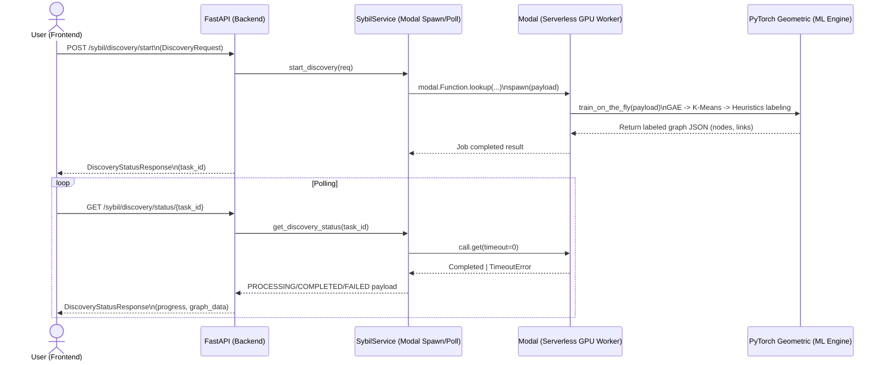
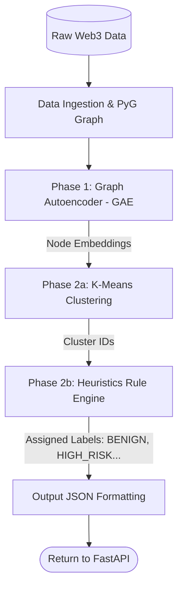

# Tài liệu Workflow Chi Tiết - Module 1 (Sybil Discovery Engine)

## Mục lục

- [1. Tổng quan kiến trúc (Architecture Overview)](#1-tổng-quan-kiến-trúc-architecture-overview)
- [2. Tiền xử lý dữ liệu & Trích xuất đặc trưng (Data Ingestion & Feature Engineering)](#2-tiền-xử-lý-dữ-liệu--trích-xuất-đặc-trưng-data-ingestion--feature-engineering)
- [3. Luồng Học máy cốt lõi (Core ML Pipeline)](#3-luồng-học-máy-cốt-lõi-core-ml-pipeline)
  - [3.1. Phase 1: Unsupervised Learning (GAE)](#31-phase-1-unsupervised-learning-gae)
  - [3.2. Phase 2: Clustering & Pseudo-labeling (K-Means + Heuristics)](#32-phase-2-clustering--pseudo-labeling-k-means--heuristics)
- [4. Kết xuất đầu ra (Output Formatting)](#4-kết-xuất-đầu-ra-output-formatting)

---

## 1. Tổng quan kiến trúc (Architecture Overview)

**Module 1 (Sybil Discovery Engine)** thực thi mục tiêu khám phá và phân cụm
nhằm gán nhãn rủi ro (Data Annotation) cho tập tài khoản Web3 trong một
`time_range`. Điểm cốt lõi của thiết kế là **train-on-the-fly**: thay vì dựa
vào mô hình tiền huấn luyện cố định, hệ thống tái tạo đồ thị và khởi tạo pipeline
học máy ngay theo dữ liệu truy vấn được.

### 1.1. Chuỗi tương tác (Mermaid Sequence Diagram) - Bắt buộc



### 1.2. Công nghệ, Thư viện & Điều kiện cần thiết

- **Thư viện Backend & AI:**
  - **Hạ tầng:** `fastapi` (API Gateway), `modal` (Serverless GPU Worker).
  - **AI Engine:** `torch` (PyTorch 2.1.2+cu121), `torch_geometric` (PyG) cho xử lý đồ thị.
  - **Xử lý ngôn ngữ & Thống kê:** `sentence-transformers` (model `all-MiniLM-L6-v2`), `scikit-learn` (K-Means), `networkx`.
- **Hạ tầng Dữ liệu:** `google-cloud-bigquery`, `pandas`, `rapidfuzz`.
- **Điều kiện môi trường (Prerequisites):**
  - `GOOGLE_APPLICATION_CREDENTIALS`: Đường dẫn đến Service Account Key để truy vấn BigQuery.
  - `MODAL_TOKEN_ID` & `MODAL_TOKEN_SECRET`: Để xác thực và kích hoạt Serverless GPU trên Modal.

### 1.3. Vai trò các thành phần

| Thành phần            | Vai trò                                                                          |
| --------------------- | -------------------------------------------------------------------------------- |
| Frontend              | Gửi `DiscoveryRequest`, nhận `task_id`, polling trạng thái và render đồ thị.     |
| FastAPI (API Gateway) | Quản lý endpoint start/status; không block event loop khi job nặng đang chạy.    |
| SybilService          | Thực hiện Modal `lookup` + `.spawn()` và cơ chế polling `call.get(timeout=0)`.   |
| Modal GPU Worker      | Contain môi trường ML; lazy-import toàn bộ thư viện nặng; chạy pipeline học máy. |
| PyTorch Geometric     | Biểu diễn đồ thị (`torch_geometric.data.Data`) và huấn luyện mô hình GAE/GNN.    |

---

## 2. Tiền xử lý dữ liệu & Trích xuất đặc trưng (Data Ingestion & Feature Engineering)

Pipeline dữ liệu trong Module 1 (theo Colab code) được xây dựng từ Lens Protocol
trên BigQuery. Trong `build_datasets.py`, các bước có thể tóm tắt như sau:

### 2.1. Nguồn dữ liệu (Data Sources)

- **Account Metadata**: `lens-protocol-mainnet.account.metadata`
  - `created_on`, `name`, `metadata` (bao gồm `lens.bio`, `lens.picture`, ...).
  - `owned_by` từ `account.known_smart_wallet`.
  - `trust_score` từ `ml.account_score`.
  - `handle` từ `username.record` (lấy handle mới nhất theo thời gian).
- **Post Summary**: `account.post_summary`
  - tập đặc trưng hành vi tổng hợp: `total_tips`, `total_posts`, `total_quotes`,
    `total_reacted`, `total_reactions`, `total_reposts`, `total_collects`,
    `total_comments`.
- **Follower Summary**: `account.follower_summary`
  - `total_followers`, `total_following`.
- **Edges**:
  - Follow edges từ `account.follower`.
  - Interaction edges từ:
    - `post.record` (COMMENT/QUOTE)
    - `post.reaction` (UPVOTE/REACTION)
    - `post.action_executed` (TIP/COLLECT)
  - Co-owner edges từ `account.known_smart_wallet` (quan hệ chia sẻ `owned_by`).
  - Similarity edges (các loại “tương đồng”) được tạo qua:
    - avatar trùng (picture URL trùng),
    - close creation time (thời gian tạo trong cửa sổ),
    - fuzzy handle (Levenshtein-like qua RapidFuzz),
    - semantic bio similarity (S-BERT / MiniLM).

#### 2.1.1. Truy xuất dữ liệu gốc (BigQuery SQL)

Hệ thống truy xuất dữ liệu từ `lens-protocol-mainnet` và phân loại thành hai nhóm chính: **Nodes (Thực thể)** và **Edges (Quan hệ)**.

**A. Dữ liệu Nodes (Tài khoản & Đặc trưng hành vi):**

- **Metadata & Trust Score:** Lấy thông tin cơ bản, handle mới nhất và điểm tín nhiệm từ ML model của Lens.

```sql
SELECT
    `lens-protocol-mainnet.app.FORMAT_HEX`(meta.account) as profile_id,
    ANY_VALUE(meta.created_on) as created_on,
    ANY_VALUE(meta.name) as display_name,
    ANY_VALUE(meta.metadata) as metadata,
    ANY_VALUE(`lens-protocol-mainnet.app.FORMAT_HEX`(ksw.owned_by)) as owned_by,
    ARRAY_AGG(usr.local_name ORDER BY usr.timestamp DESC LIMIT 1)[OFFSET(0)] as handle,
    ARRAY_AGG(score.score ORDER BY score.generated_at DESC LIMIT 1)[OFFSET(0)] as trust_score
FROM `lens-protocol-mainnet.account.metadata` as meta
LEFT JOIN `lens-protocol-mainnet.username.record` as usr ON meta.account = usr.account
LEFT JOIN `lens-protocol-mainnet.account.known_smart_wallet` as ksw ON meta.account = ksw.address
LEFT JOIN `lens-protocol-mainnet.ml.account_score` as score ON meta.account = score.account
WHERE meta.created_on >= '{START}' AND meta.created_on < '{END}'
GROUP BY 1
```

- **Hành vi On-chain (Post & Follower Summary):** Truy xuất các chỉ số tổng hợp như `total_posts`, `total_collects`, `total_followers`, v.v. để làm đặc trưng số (numeric features).

**B. Dữ liệu Edges (Quan hệ tương tác):**

- **Social Edges (Follow):**

```sql
SELECT DISTINCT
    `lens-protocol-mainnet.app.FORMAT_HEX`(f.account_follower) as source,
    `lens-protocol-mainnet.app.FORMAT_HEX`(f.account_following) as target,
    'FOLLOW' as type
FROM `lens-protocol-mainnet.account.follower` as f
```

- **Interaction Edges (Comment/Quote/Reaction/Action):**

```sql
-- Ví dụ truy vấn Reaction (UPVOTE)
SELECT
    `lens-protocol-mainnet.app.FORMAT_HEX`(r.account) as source,
    `lens-protocol-mainnet.app.FORMAT_HEX`(p.account) as target,
    r.type, r.action_at as timestamp
FROM `lens-protocol-mainnet.post.reaction` as r
JOIN `lens-protocol-mainnet.post.record` as p ON r.post = p.id
WHERE r.account != p.account
```

#### 2.1.2. Xây dựng các tầng quan hệ đặc thù (Off-chain Building)

Bên cạnh dữ liệu từ SQL, các tầng quan hệ quan trọng để phát hiện Sybil được xây dựng bằng logic Python:

1.  **Co-Owner Layer:** Thực hiện tự nối (Self-join) bảng Nodes dựa trên trường `owned_by`. Nếu hai `profile_id` có chung một `owned_by` (địa chỉ ví quản lý), một cạnh `CO-OWNER` sẽ được tạo ra.
2.  **Similarity Layer:** Sử dụng các kỹ thuật so sánh để tìm kiếm sự trùng lặp có hệ thống:
    - **Same Avatar:** So khớp trực tiếp URL ảnh đại diện.
    - **Close Creation Time:** Tìm các cặp tài khoản được tạo cách nhau trong khoảng thời gian cực ngắn (ví dụ: < 5 giây).
    - **Fuzzy Handle:** Dùng `RapidFuzz` để tính độ tương đồng giữa các username (Sybil thường dùng tên có cấu trúc giống nhau như `user1`, `user2`).
    - **Semantic Bio:** Sử dụng S-BERT (`all-MiniLM-L6-v2`) để tính Cosine Similarity giữa các đoạn giới thiệu (Bio).

#### 2.1.3. Tổng hợp và Tiền xử lý Dataset (Synthesis)

Dữ liệu sau khi thu thập được tổng hợp qua các bước:

1.  **Merge Node Data:** Kết hợp Metadata và các chỉ số hành vi thành một bảng `nodes_full.csv`.
2.  **Flatten Edge Data:** Gộp tất cả các loại cạnh (Follow, Interact, Co-Owner, Similarity) vào một file `edges.csv` duy nhất, định danh rõ `layer` và `type`.
3.  **Gán trọng số (Weighting):** Mỗi loại cạnh được gán một `weight` (Trọng số rủi ro/thân thiết). Ví dụ: `CO-OWNER` (5), `COLLECT` (4), `FOLLOW` (2).
4.  **Cắt tỉa (Pruning):** Loại bỏ các node cô lập (không có bất kỳ liên kết nào) để tối ưu hóa quá trình huấn luyện đồ thị, tạo ra `nodes_full_pruned.csv`.

**Kết quả Dataset cuối cùng:**

- `nodes_full_pruned.csv`: Chứa thông tin định danh và đặc trưng của các node có liên kết.
- `edges_weighted.csv`: Danh sách các cạnh kèm theo trọng số và phân lớp quan hệ.
- `id_to_index.json`: Bảng ánh xạ từ Hex ID sang Index (số nguyên) để PyG xử lý.

### 2.2. Cấu trúc Node (Nodes)

Trong `build_datasets.py`, một Node tương ứng một tài khoản Web3 (Lens profile)
được lưu theo `profile_id`. Các field quan trọng gồm:

| Field          | Ý nghĩa                                              |
| -------------- | ---------------------------------------------------- |
| `profile_id`   | ID đã chuẩn hóa dưới dạng hex string.                |
| `created_on`   | Thời điểm tài khoản được tạo.                        |
| `display_name` | Tên hiển thị.                                        |
| `metadata`     | JSON metadata; chứa `lens.bio` và `lens.picture`.    |
| `owned_by`     | Smart wallet chủ sở hữu (dùng cho Co-owner).         |
| `handle`       | Tên người dùng dạng handle.                          |
| `trust_score`  | Điểm tin cậy “nguồn” (dùng trong heuristics rủi ro). |

### 2.3. Cấu trúc Edge (Edges)

Module 1 hợp nhất 4 nhóm cạnh (edges) và gắn **layer** để phân biệt bản chất:

| Layer        | Nguồn                                                  | Edge `type` (ví dụ)                                             | Hướng                 |
| ------------ | ------------------------------------------------------ | --------------------------------------------------------------- | --------------------- |
| `Follow`     | `account.follower`                                     | `FOLLOW`                                                        | Có hướng (directed)   |
| `Interact`   | `post.record`, `post.reaction`, `post.action_executed` | `COMMENT`, `QUOTE`, `UPVOTE`, `TIP`, `COLLECT`, ...             | Có hướng (directed)   |
| `Co-Owner`   | `known_smart_wallet`                                   | `CO-OWNER`                                                      | Vô hướng (undirected) |
| `Similarity` | so trùng ảnh/handle/bio/thời gian                      | `SAME_AVATAR`, `FUZZY_HANDLE`, `SIM_BIO`, `CLOSE_CREATION_TIME` | Vô hướng (undirected) |

#### 2.3.1. Cơ chế gán trọng số (Edge Weighting Strategy)

Trọng số cạnh đóng vai trò quan trọng trong việc định hướng cơ chế Attention của GAT. Các giá trị trọng số được quy định dựa trên mức độ "tin cậy" hoặc "rủi ro Sybil" của mối quan hệ:

| Nhóm quan hệ   | Loại cạnh (`type`)           | Trọng số (`weight`) | Ý nghĩa kỹ thuật                               |
| :------------- | :--------------------------- | :------------------ | :--------------------------------------------- |
| **Co-Owner**   | `CO-OWNER`                   | **5**               | Mối liên kết mạnh nhất (cùng chủ sở hữu ví).   |
| **Interact**   | `COLLECT`                    | **4**               | Hành động tốn phí/gas, có giá trị kinh tế cao. |
|                | `MIRROR`                     | **3**               | Lan tỏa nội dung (tương tác tích cực).         |
|                | `COMMENT`, `QUOTE`           | **2**               | Tương tác nội dung cơ bản.                     |
|                | `UPVOTE`, `REACTION`         | **1**               | Tương tác nhẹ nhất.                            |
| **Follow**     | `FOLLOW`                     | **2**               | Mối quan hệ mạng xã hội cơ bản.                |
| **Similarity** | `SAME_AVATAR`, `SIM_BIO`     | **3**               | Dấu hiệu sao chép hồ sơ (Profile Copying).     |
|                | `FUZZY_HANDLE`, `CLOSE_TIME` | **2**               | Dấu hiệu sinh tự động (Bot Scripting).         |

Dữ liệu trọng số này sau đó được chuẩn hóa và đưa vào tensor `edge_attr` của PyG để huấn luyện mô hình GAE.

### 2.4. Trích xuất đặc trưng (Feature Engineering)

Trong `fullflow.py`, pipeline feature engineering nhằm tạo ma trận node features `X`
phục vụ cho GAE/GNN.

#### 2.4.1. Semantic Text Embedding

- Dùng `SentenceTransformer('all-MiniLM-L6-v2')`.
- Tạo chuỗi văn bản cho mỗi node:
  - `Handle: {handle}. Name: {display_name}. Bio: {bio}`.
- Encode thu được vector embedding (384 chiều).
- Embedding này đóng vai trò **semantic structural prior**: Sybil thường có dấu hiệu
  “mẫu” (templates) ở nội dung bio/handle.

#### 2.4.2. Ảnh (Image/Avaatar Feature)

- Tạo đặc trưng nhị phân:
  - `img_feat = 1` nếu picture_url hợp lệ và không phải avatar mặc định,
  - `img_feat = 0` nếu picture_url trống/không hợp lệ hoặc chứa từ “default”.

#### 2.4.3. Thống kê on-chain (Numeric Features)

Các đặc trưng hành vi numeric gồm:

- `total_tips`, `total_posts`, `total_quotes`, `total_reacted`,
  `total_reactions`, `total_reposts`, `total_collects`, `total_comments`,
  `total_followers`, `total_following`.
- `days_active` = số ngày từ `created_on` đến “hiện tại” (UTC).

Chuẩn hóa:

- `fullflow.py` thực thi chuẩn hóa (MinMax/Standard) theo giai đoạn xử lý:
  - giai đoạn chuẩn bị ban đầu: `MinMaxScaler`.
  - giai đoạn tạo tensor học trên PyG: `StandardScaler`.

#### 2.4.4. Chuẩn bị dữ liệu cho PyG

- Map `profile_id -> node index` thông qua `id_to_index.json`.
- Tạo tensor `x`:
  - concatenation của numeric features đã scale và text embeddings.
- Tạo `edge_index` và `edge_attr`:
  - `edge_index` là cặp `(source_idx, target_idx)`.
  - `edge_attr` dùng `weight` từ `edges_weighted.csv` và ép shape về `(-1, 1)`.

---

## 3. Luồng Học máy cốt lõi (Core ML Pipeline)

### 3.0. Luồng pipeline (Mermaid Flowchart) - Bắt buộc



### 3.1. Phase 1: Unsupervised Learning (GAE)

Trong `fullflow.py`, giai đoạn học không giám sát sử dụng mô hình **GAE (Graph Autoencoder)** với kiến trúc Encoder dựa trên **GAT (Graph Attention Network)** để trích xuất đặc trưng cấu trúc đồ thị.

#### 3.1.1. Kiến trúc Encoder (`GATEncoder`)

Mô hình `GATEncoder` được thiết kế để học các vector nhúng (embeddings) cho các node dựa trên cả đặc trưng nội tại và cấu trúc liên kết:

- **Dữ liệu đầu vào (Input):** Tiếp nhận Node Features $X$ với số chiều dựa trên `data.num_features` (thường là ~396 chiều, bao gồm 384 chiều text embedding, 1 chiều avatar feature và 11 chiều đặc trưng on-chain/thời gian).
- **Lớp GATConv 1:**
  - `in_channels` $\to$ 32 hidden channels.
  - Số lượng Attention `heads=4`.
  - `dropout=0.1` giúp chống overfitting.
  - `edge_dim=1`: Cho phép mô hình tiếp nhận trọng số cạnh (edge weights) từ BigQuery.
  - Hàm kích hoạt: `F.elu`.
- **Lớp GATConv 2 (Output Layer):**
  - $32 \times 4$ (concat từ 4 heads của layer 1) $\to$ `out_channels` (16 chiều).
  - `heads=1`, `concat=False`.
  - `edge_dim=1`.
  - Đầu ra của lớp này là ma trận vector nhúng $Z$ (shape: $N \times 16$).

```python
class GATEncoder(torch.nn.Module):
    def __init__(self, in_channels, out_channels):
        super().__init__()
        # Layer 1: GATConv với 4 heads và Dropout
        self.conv1 = GATConv(in_channels, 32, heads=4, dropout=0.1, edge_dim=1)

        # Layer 2: GATConv đầu ra (concat=False để lấy trung bình/heads cuối)
        self.conv2 = GATConv(32 * 4, out_channels, heads=1, concat=False, dropout=0.1, edge_dim=1)

    def forward(self, x, edge_index, edge_attr):
        x = self.conv1(x, edge_index, edge_attr=edge_attr)
        x = F.elu(x)
        x = F.dropout(x, p=0.1, training=self.training)
        x = self.conv2(x, edge_index, edge_attr=edge_attr)
        return x

# Khởi tạo mô hình GAE với Encoder là GAT
model = GAE(GATEncoder(in_channels, out_channels))
```

#### 3.1.2. Cơ chế Decoder & Mục tiêu tối ưu

Mô hình sử dụng **Inner Product Decoder** để tái tạo ma trận kề của đồ thị:

- **Phép toán:** Xác suất tồn tại cạnh giữa node $i$ và $j$ được tính bằng tích vô hướng: $\hat{A}_{ij} = \sigma(z_i^T z_j)$, trong đó $\sigma$ là hàm sigmoid.
- **Mục tiêu tối ưu (Reconstruction Loss):**
  - Hệ thống tối ưu hóa Binary Cross Entropy (BCE) loss giữa ma trận kề gốc $A$ và ma trận tái tạo $\hat{A}$.
  - Mô hình học cách ép các node có liên kết thực tế (hoặc có lân cận tương đồng) về gần nhau trong không gian 16 chiều.

#### 3.1.3. Ghi nhận embeddings đầu ra

Sau khi hội tụ hoặc early stopping:

- Lấy `z_final` từ `model.encode(...)`.
- Lưu `node_embeddings.npy` làm đầu vào cho K-Means ở Phase 2.

### 3.2. Phase 2: Clustering & Pseudo-labeling (K-Means + Heuristics)

Phase này gồm 2 tầng: **(i) clustering không giám sát** và **(ii) gán nhãn rủi ro bằng hệ luật**.

#### 3.2.1. K-Means Clustering

- Dùng embeddings `embeddings` (tạo từ GAE) để chạy clustering.
- **Dynamic K Calculation:** Số lượng cụm (K) không còn cố định mà được tính toán động dựa trên quy mô đồ thị theo công thức:
  $K = 21 \times \sqrt{\frac{N_{nodes}}{300}}$
  (Công thức được tối ưu dựa trên benchmark 300 nodes tiêu chuẩn).

#### 3.2.2. Heuristics pseudo-labeling (4 lớp)

Pseudo-labeling được thực thi ở cấp **cluster** thay vì node độc lập,
để giảm nhiễu và tận dụng thống kê cạnh nội bộ.

Các bước chính:

1. Lọc **internal edges**:

- chỉ giữ cạnh có `src_cluster == dst_cluster`.

2. Tính thống kê cluster:

- `avg_trust`: trung bình `trust_score` của node trong cluster.
- `std_creation_hours`: độ lệch chuẩn thời gian tạo (chuẩn hóa theo giờ).
- `pct_co_owner`: tỷ lệ trọng số edge type `CO-OWNER`.
- `pct_fuzzy_handle`: tỷ lệ trọng số edge type `FUZZY_HANDLE`.
- `pct_similarity`: tỷ lệ trọng số edge type trong `SIM_BIO`,
  `CLOSE_CREATION_TIME`, `FUZZY_HANDLE`.
- `pct_social`: tỷ lệ trọng số edge type trong nhóm social (`FOLLOW`, `UPVOTE`,
  `COMMENT`, `COLLECT`).

3. Áp dụng **Additive Risk Scoring** (Cập nhật ngưỡng rủi ro):

- Điểm rủi ro được cộng theo các điều kiện (threshold) và tối đa hóa về `<= 100`.
- **Bảng trọng số rủi ro mới:**
  - `PCT_CO_OWNER > 0.15` -> **+40**
  - `PCT_SIMILARITY >= 0.50` -> **+30**
  - `STD_CREATION_HOURS < 0.5h` -> **+15**
  - `PCT_FUZZY_HANDLE >= 0.50` -> **+15**
  - `PCT_SOCIAL <= 0.15` -> **+10**
  - `AVG_TRUST <= 5` -> **+20**
  - `AVG_TRUST <= 10` -> **+10**

4. Quy đổi sang 4 nhãn rời rạc (fuzzy labeling):

| Range risk_score | Label (4 classes) |
| ---------------- | ----------------- |
| `< 20`           | `BENIGN`          |
| `20 .. 50`       | `LOW_RISK`        |
| `50 .. 80`       | `HIGH_RISK`       |
| `>= 80`          | `MALICIOUS`       |

1. Gán nhãn node:

- node nhận nhãn dựa trên `cluster_label` của nó.
- Nhãn được làm sạch (sanitized) bằng cách loại bỏ tiền tố số (ví dụ: `0_BENIGN` -> `BENIGN`).

---

## 4. Kết xuất đầu ra (Output Formatting)

Module 1 cần xuất kết quả dưới dạng JSON để FastAPI gateway và Frontend
tiêu thụ đồng nhất. Chuẩn map dự kiến là:

- `nodes`: danh sách node, mỗi node chứa:
  - `id`: định danh string (thường map từ `profile_id` hoặc index),
  - `label`: tên lớp (BENIGN/LOW_RISK/HIGH_RISK/MALICIOUS),
  - `cluster_id`: ID cụm (KMeans label),
  - `risk_score`: điểm rủi ro (0..100),
  - `attributes`: dict tùy biến (ví dụ `address`/`handle`/`trust_score`).
- `links`: danh sách edge, mỗi edge chứa:
  - `source`, `target`: ID node,
  - `edge_type`: ánh xạ từ `type` gốc (`FOLLOW`, `COMMENT`, `CO-OWNER`, ...),
  - `weight`: trọng số cạnh.

### 4.1. Đóng gói GraphDataSchema ngay sau Heuristics

Ngay sau khi hệ luật `Heuristics Rule Engine` hoàn tất việc gán nhãn lên
`cluster_id` (và suy ngược để xác định nhãn cho `nodes`), pipeline đóng gói kết quả
thành định dạng chuẩn `GraphDataSchema` (JSON) để trả về cho FastAPI và Frontend.

Cấu trúc JSON:

- `nodes`: mảng node (mỗi node tối thiểu có `id`, `cluster_id`, `risk_score`, `label`).
- `links`: mảng edge (`source`, `target`, `edge_type`, `weight`).

### 4.2. Ràng buộc tương thích với backend

Backend FastAPI/Modal cần output có:

- `nodes` là list,
- `links` là list,
- schema nhất quán với `GraphDataSchema`:
  - `nodes[].attributes` bắt buộc là dict,
  - `links[].weight` kiểu số float.

> Lưu ý: Trong ứng dụng hiện tại, `modal_worker/app.py` đang là skeleton
> trả về dummy graph để validate luồng. Tài liệu này mô tả workflow “full”
> theo `docs/colab-code/fullflow.py` và `build_datasets.py`.
> ��ng hiện tại, `modal_worker/app.py` đang là skeleton
> trả về dummy graph để validate luồng. Tài liệu này mô tả workflow “full”
> theo `docs/colab-code/fullflow.py` và `build_datasets.py`.
