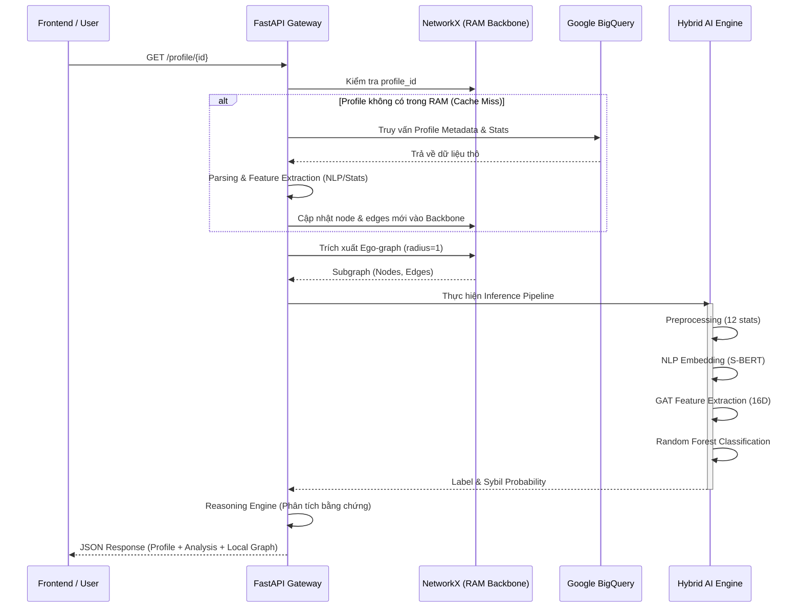

# Module 2: Profile Inspector & Real-time Inference

Tài liệu này mô tả chi tiết quy trình hoạt động của **Module 2**, từ lúc nhận yêu cầu kiểm tra profile cho đến khi trả về kết quả phân loại Sybil bằng mô hình Hybrid AI (GAT + Random Forest).

---

## 1. Tổng quan Luồng công việc (Workflow)

Module 2 hoạt động theo cơ chế **Hybrid Cache & Real-time Inference**. Hệ thống ưu tiên truy vấn dữ liệu từ RAM (Backbone) để đạt tốc độ phản hồi cực nhanh, đồng thời tích hợp pipeline suy luận AI đa tầng.

### 1.1. Sơ đồ trình tự (Sequence Diagram)



---

## 2. Các thành phần chính

### 2.1. Graph Backbone (NetworkX)
- **Vai trò**: Lưu trữ toàn bộ đồ thị tham chiếu (Reference Graph) trong RAM.
- **Dữ liệu**: Chứa các thuộc tính node (handle, bio, stats) và các quan hệ (follow, interact, co-owner...).
- **Tốc độ**: Cho phép trích xuất ego-graph trong khoảng **< 10ms**.

### 2.2. Fallback Pipeline (BigQuery)
Khi một profile chưa có trong Backbone, hệ thống sẽ:
1.  Truy vấn BigQuery để lấy metadata mới nhất.
2.  Tính toán các chỉ số on-chain (ví dụ: `days_active`).
3.  Tạo Semantic Embedding (S-BERT) cho Bio/Handle.
4.  Cập nhật động vào NetworkX để phục vụ các yêu cầu sau này.

---

## 3. Quy trình AI Inference (Hybrid Pipeline)

Để đảm bảo tính chính xác, quy trình Inference trong Module 2 được thiết kế **đồng bộ 100%** với quy trình Training tại Module 1.

### Bước 1: Tiền xử lý thuộc tính Node (Preprocessing)
Hệ thống trích xuất đúng 12 cột đặc trưng theo thứ tự bắt buộc:
- `trust_score`, `total_tips`, `total_posts`, `total_quotes`, `total_reacted`, `total_reactions`, `total_reposts`, `total_collects`, `total_comments`, `total_followers`, `total_following`, `days_active`.
- Dữ liệu được đẩy qua `feature_scaler.bin` (MinMaxScaler).

### Bước 2: Xử lý ngôn ngữ tự nhiên (NLP)
Sử dụng mô hình `all-MiniLM-L6-v2` để chuyển đổi Profile (Handle, Name, Bio) thành vector 384 chiều theo cú pháp:
`"Handle: {handle}. Name: {name}. Bio: {bio}"`

### Bước 3: Tích hợp cấu trúc (GAT Encoder)
- **Input**: Vector 396 chiều (12 stats + 384 NLP) + Đồ thị cục bộ (Ego-graph).
- **Process**: GAT thực hiện cơ chế Attention trên các node lân cận để nắm bắt hành vi quan hệ.
- **Output**: Một vector **Structural Embedding 16 chiều**.

### Bước 4: Phân loại cuối cùng (Random Forest)
- Vector 16D được chuẩn hóa qua `scaler_gat_ml.pkl`.
- Mô hình Random Forest (`random_forest_gat.pkl`) thực hiện dự đoán xác suất Sybil (Class 3).

---

## 4. Reasoning Engine (Công cụ lý giải)

Thay vì chỉ trả về một con số, Module 2 cung cấp lời giải thích dựa trên:
1.  **AI Confidence**: Mức độ tin tưởng của mô hình vào dự đoán.
2.  **Graph Evidence**: Quét các cạnh rủi ro trực tiếp trong ego-graph:
    - **CO-OWNER**: Cùng một địa chỉ sở hữu nhiều profile.
    - **SIM_BIO**: Tiểu sử tương đồng (copy-paste).
    - **FUZZY_HANDLE**: Tên tài khoản có cấu trúc sinh tự động (ví dụ: `user123`, `user124`).
    - **SAME_AVATAR**: Sử dụng cùng một hình ảnh đại diện.

---

## 5. Cấu trúc dữ liệu phản hồi (Response Schema)

```json
{
  "profile_info": { ... },
  "analysis": {
    "predict_label": "HIGH_RISK",
    "predict_proba": {
      "BENIGN": 0.05,
      "LOW_RISK": 0.03,
      "HIGH_RISK": 0.92,
      "MALICIOUS": 0.00
    },
    "reasoning": [
      "AI model detected strong Sybil-like behavior (Confidence: 92.0%). Risk-associated connections: 2x CO-OWNER, 1x SIMILARITY."
    ],
    "neighbor_labels": {
      "0x123...": "HIGH_RISK",
      "0x456...": "BENIGN"
    }
  },
  "local_graph": {
    "nodes": [ ... ],
    "links": [ ... ]
  }
}
```

---

> [!NOTE]
> Module 2 được tối ưu hóa cho việc kiểm tra đơn lẻ (Single Inspection). Đối với việc phát hiện hàng loạt trên quy mô lớn, vui lòng tham khảo [Module 1 Workflow](module1_detailed_workflow.md).
ability": 0.92,
    "classification": "HIGH_RISK",
    "reasoning": [
      "AI model detected strong Sybil-like behavior (Confidence: 92.0%). Risk-associated connections: 2x CO-OWNER, 1x SIM_BIO."
    ]
  },
  "local_graph": {
    "nodes": [ ... ],
    "links": [ ... ]
  }
}
```

---

> [!NOTE]
> Module 2 được tối ưu hóa cho việc kiểm tra đơn lẻ (Single Inspection). Đối với việc phát hiện hàng loạt trên quy mô lớn, vui lòng tham khảo [Module 1 Workflow](module1_detailed_workflow.md).
